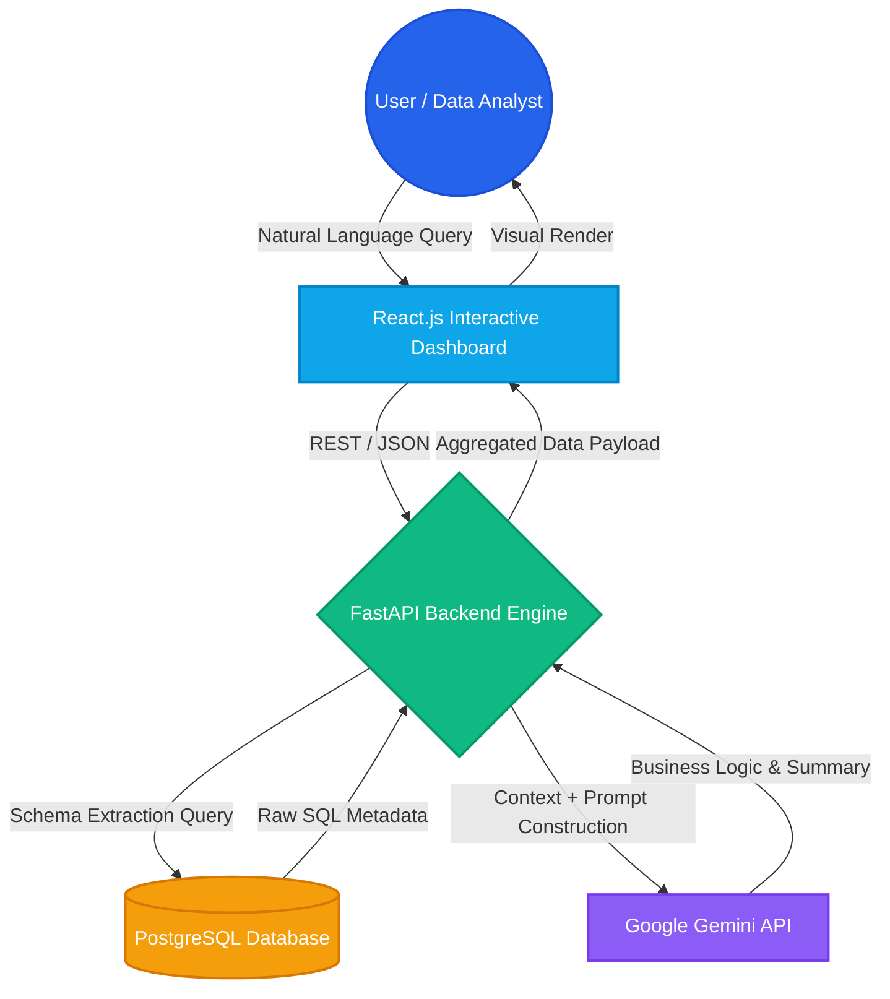
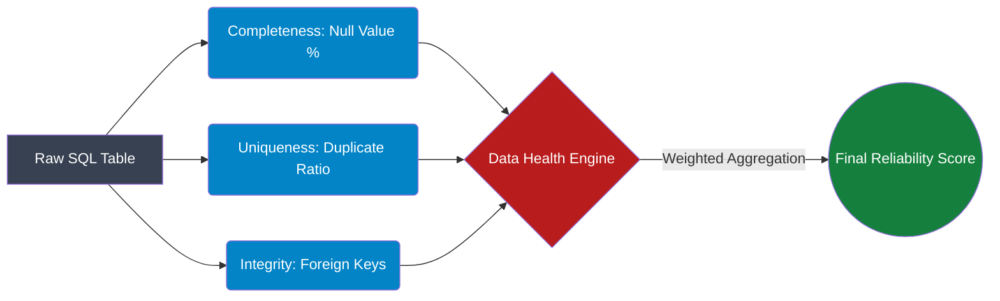

<div align="center">
  <h1>🛡️ DataSentinel AI</h1>
  <p><b>Intelligent Data Governance & Metadata Analytics Engine</b></p>
  
  []()
  []()
  []()
  []()
  []()
</div>


---

## 📖 Overview

**DataSentinel AI** transforms raw, undocumented relational databases into an intelligent knowledge layer. It automatically extracts SQL schemas, evaluates data quality, and utilizes Google Gemini AI to generate business-context explanations for complex technical data. 

Instead of just storing data, DataSentinel AI **understands** it, reducing developer onboarding time and mitigating compliance risks through automated schema documentation.

---

## ⚡ Core Features

* **Real-Time Schema Extraction:** Automatically maps tables, columns, datatypes, and foreign keys directly from the relational database using `information_schema`.
* **Scientific Data Health Scoring:** Computes an evidence-based reliability score by querying actual database metrics (null values, duplicates).
* **Context-Aware AI Intelligence:** Feeds live schema metadata to Gemini AI to generate accurate, business-friendly documentation and answer natural language queries.
* **Interactive Enterprise Dashboard:** A React-powered visualization layer displaying real-time metrics, structural relationships, and AI interactions.
* **PII & Sensitivity Detection:** Flags potentially sensitive data fields based on schema nomenclature and AI semantic analysis.

---

## 🏗️ System Architecture

DataSentinel AI operates on a strictly decoupled microservices architecture, ensuring real-time synchronization between the database layer and the AI reasoning engine.



---

## 📊 Data Health Scoring Engine

The health score is not an arbitrary number. It is dynamically calculated by querying the database using a strict weighted algorithm.

**Evaluation Formula:**

$$Score = (0.40 \times Completeness) + (0.30 \times Uniqueness) + (0.30 \times Referential Integrity)$$



---

## 🛠️ Technical Stack

| Category | Technology | Purpose |
| --- | --- | --- |
| **Frontend** | React.js, Tailwind CSS | High-performance interactive visualization |
| **Backend** | Python, FastAPI | Asynchronous REST API routing & logic |
| **Database ORM** | SQLAlchemy | Database-agnostic schema inspection |
| **AI Layer** | Google Gemini `1.5-flash` | Semantic analysis and contextual querying |
| **Server** | Uvicorn | Lightning-fast ASGI production server |

---

## 📂 Repository Structure

```text
intelligent-data-dictionary-agent/
│
├── backend/                  # Core Python FastAPI Application
│   ├── .env                  # Environment Variables (Ignored)
│   ├── database.py           # SQLAlchemy Connection Engine
│   ├── main.py               # API Routes & LLM Controllers
│   └── requirements.txt      # Python Dependencies
│
└── frontend/                 # React UI Dashboard
    ├── public/
    ├── src/
    │   ├── components/       # Reusable UI (ChatPanel, HealthCard)
    │   ├── pages/            # Main Views (Dashboard)
    │   └── services/         # API Handlers (api.js)
    ├── package.json          # Node Dependencies
    └── vite.config.js        # Build configuration

```

---

## 🚀 Quick Start Guide

### 1. Database & Backend Setup

Navigate to the backend directory and install the necessary dependencies:

```bash
cd backend
pip install -r requirements.txt

```

Create a `.env` file in the `backend` directory and add your AI credentials:

```env
GEMINI_API_KEY=your_secure_api_key_here

```

Start the ASGI server:

```bash
python -m uvicorn main:app --reload

```

*The backend API will initialize at `http://127.0.0.1:8000*`

### 2. Frontend Dashboard Setup

Open a new terminal, navigate to the frontend directory, and start the development server:

```bash
cd frontend
npm install
npm run dev

```

*The interactive dashboard will be live at `http://localhost:5173*`

---

## 🔌 Core API Reference

| Endpoint | Method | Payload | Description |
| --- | --- | --- | --- |
| `/tables` | `GET` | None | Returns a list of all detected tables in the database. |
| `/schema/{table_name}` | `GET` | None | Extracts column names and SQL datatypes. |
| `/health/{table_name}` | `GET` | None | Triggers real-time database queries to compute the reliability score. |
| `/analyze-ai/{table_name}` | `POST` | `{"question": "..."}` | Injects schema context into Gemini AI to answer user queries. |

---
